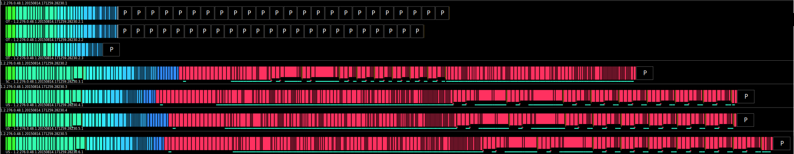

# DicomVisualizer

Renders the content of a DICOM file into a representative svg image.
Visualizes all tags contained in the DICOM not only the pixel data.

## Build:

    gradle installDist

## Usage:
Convert a single file

    DicomVisualizer -i IMAGE.DCM -o IMAGE.SVG

Convert a study

    DicomVisualizer -p ./pathToDicomFiles -o STUDY.SVG
    

## Examples:

One DICOM file

A DICOM study

